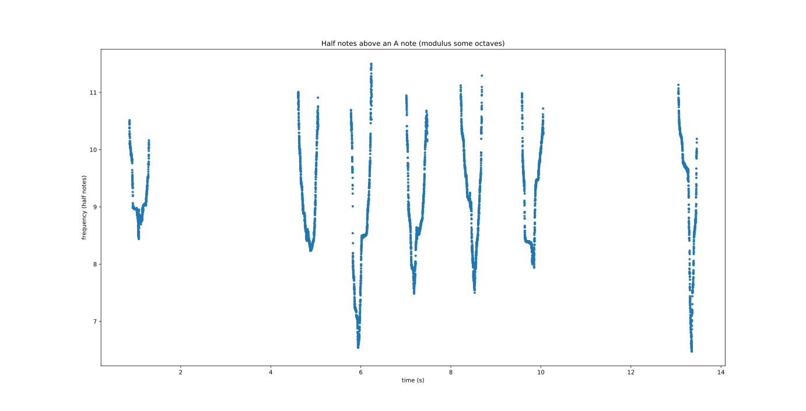

# birdsong_fft
## An attempt to visualize birdsong.

### Install requirements:

```
python -m virtualenv venv
```
or
```
python -m venv venv
```
```
pip install -r requirements.txt
```
### Run the script:
```
python fftplot1.py
```
### View the results:

